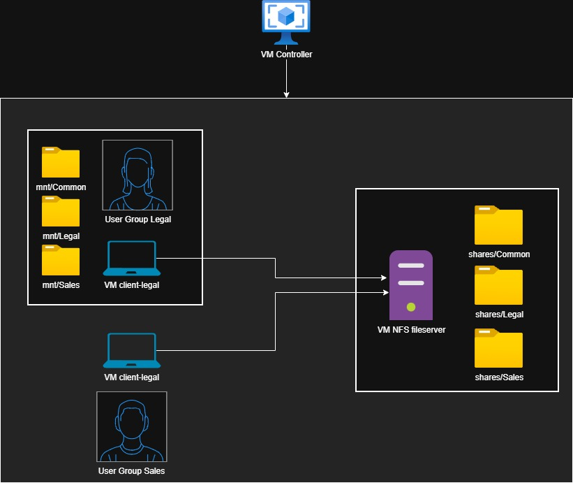
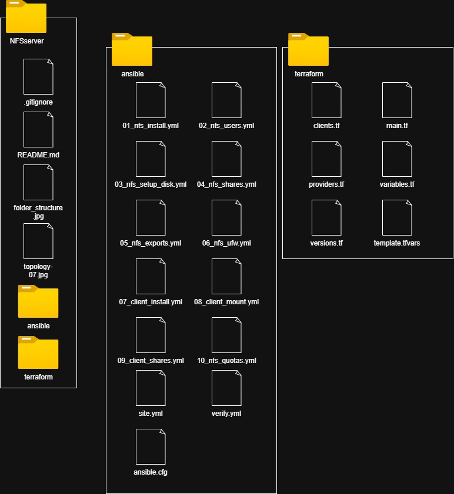

# NFSserver
authors: Marcus Kellner & Ivo Urbanovics
Course: Virtualization & Automation
Date: 2026-04-28
Branch: 05-readme
Description of project

//*Comment test 1*

//Comment test 2

# System Requirements
Proxmox VE hypervisor, tested with version 9.1.1
Hardware on hypervisor:
    RAM: 10 GB
    Disk: 60 GB
Cloud-Init template:
    Tested with Ubuntu 22.04.5 LTS / "jammy"

Workstation, Windows 10/11 or macOS Tahoe 26.4
Software on Workstation: 
    Terraform, tested with version 1.14.8
    Git, tested with git 2.53.0

# Getting Started 
## 1. Clone repository from Github
git clone [git@github.com:dittanvandarnamn/ansible-lab.git](https://github.com/marcusjkellner/NFSserver.git)
cd NFSserver

## 2. Skapa secrets-filen (se avsnittet Secrets nedan)
cp /terraform/template.tfvars /terraform/terraform.tfvars
edit terraform.tfvars with your own environment variables and keys

## 3. Starta alla VMs
cd terraform
terraform init
terraform validate #controls the terraform syntax
terraform plan #checks the terraform project for problems before running
terraform apply #

## 4. SSH in på kontrollnoden (om du har en) eller kör Ansible direkt
vagrant ssh control

## 5. Kör playbooken
cd ~/ansible-lab/ansible
git pull
ansible-playbook site.yml -v

## 6. Verifiera att allt fungerar
bash test/verify.sh

# Architecture

## Workstation (Mac or Windows)
We use Terraform from our respective workstations to create our infrastructure.

## Hypervisor (Proxmox, type 1)
To create and host our infrastructure we use Proxmox in our repective homelab environments.
This means that we need to expose IP-addresses to variables in order to adapt our code for both setups. 

For our VMs we have created a template from cloud-init. It's a Ubuntu server 22.04.5 LTS / jammy

In order to use terraform we both needed to create separate terraform API-keys. These are never uploaded to github.

Tailscale: In order to access our proxmox host for the on-site presentation, we will connect to one of our homelabs using Tailscale.

## Virtual Machines
### VM:ansible-controller
RAM: 4096 MB
Cores: 2
Disk: 10

This is the first VM we create in terraform. The other VM's are dependant on this VM in order to be created.
The ansible-controller generates an SSH keypair and injects the public key into Terraform so the following VM's will allow the
controller to SSH into them with Ansible.

On creatation, the system is updated and ansible is installed.
After this, ansible galaxy is forced to update to 2.5.9 and the old version 1.3.6 is removed.
Terrform will also git clone our public repository in order to access the ansible code.
The last Terraform action is to create a dynamic inventory.ini-file based on the local IP-addresses we have enetered into a secret variable file called terraform.tfvars.

From here, all configuration is done using ansible on the ansible controller.

Manual steps at the point of writing:
ansible controller: switch to development branch: 02-nfsclient
ansible controller: start site.yml, which will play all our playbook files:
    - 01_nfs_install
    - 02_nfs_users
    - 03a_nfs_setup_disk
    - 03b_nfs_shares
    - 04_nfs_exports
    - 05_client_install
    - 06_client_mount
    - 07_client_shares
    - 08_nfs_quotas

    The last manual step is to run verify.yml, which is an ansible playbook described in more detail below.

### VM:fileserver
RAM: 2048 MB
Cores: 2
Disk: 20 GB (10 GB OS + 10 GB Filestoreage /shares)

After creation, we format a separate partition for filestorage as /shares with support for quotas using Ansible. Ansible is used to install NFS, create users and groups, create the directories the users will share and start the NFS service.

Directories on fileserver:
/shares
    /shares/Common - all users can read and write
    /shares/Legal - only Legal-group can read and write
    /shares/Sales - only Sales-group can read and write

The last playbook sets quota limits for groups and users, but currently only the group quotas are applied succesfully.

### VM:client-legal
This VM is a standard ubuntu server install. Here we create users and groups with identical UID and GID to match the ones created on the fileserver. 

Currently users Anna_Legal and Peter_Sales are created on both clients and the fileserver simultaneusly.

RAM: 2048 MB
Cores: 2
Disk: 10

### VM:client-sales
This VM is a standard ubuntu server install. Here we create users and groups with identical UID and GID to match the ones created on the fileserver. 

Currently users Anna_Legal and Peter_Sales are created on both clients and the fileserver simultaneusly.

RAM: 2048 MB
Cores: 2
Disk: 10

# Folder Structure

# Environment variables, IPs and secrets
See the file "template.tfvars", copy this file and rename it as "terraform.tfvars". Do NOT upload this info into Github ever, terraform.tfvars has been added to .gitignore to prevent this.
    os_type = "windows" OS-type, can be set to "windows" or "mac"

    api_token      = "" You need to create an API token in proxmox for terraform use and enter it here
    ssh_public_key = "" Enter a public ssh key for your workstation host

    endpoint    = "https://192.168.1.200:8006" IP for proxmox endpoint
    nodename    = "pve" local proxmox nodename
    VMTemplateID    = 1100 The VM-template ID of the cloud-init you want to use for the base of all VM's. WE recommend using Ubuntu 24.4.04 "Jammy"

    vm_gateway  = "192.168.1.1" #Enter the IP of your default gateway (likely your ISP router) 

    controller_ip   = "192.168.1.41/24" IP of the ansible control node
    fileserver_ip   = "192.168.1.42/24" IP of the NFS fileserver
    clientLegal_ip  = "192.168.1.43/24" IP of the Legal client VM
    clientSales_ip  = "192.168.1.44/24" IP of the Sales client VM

# Ansible playbooks
01_nfs_install
    Updates the system with apt update and downloads nfs filserver and quote tools.

02_nfs_users
    Creates two user groups: Legal and Sales.
    Creates two different users, one for Legal, (Anna_Legal) and one for Sales (Peter_Sales)
    Each group and user are assigned their explicit GID and UID.
        Note: These groups and users are created identically on the fileserver and all clients.

03a_nfs_setup_disk
    Creates a new partition and formats it for use with the quote-system. 
    Creates the /shares directory on the new partition and mounts /shares for file storage.
    There are checks that measures if the disk is present and have been formatted at least once in order to preserve ideompotency.
        /shares
            mode: 0755
                Root can read, write, enter
                Legal and Sales can read, enter, not write
                Others can read, enter, not write
    /etc/fstab is configured for automount on reboot.

03b_nfs_shares
    Creates three directory types: 

        /shares/Common 
            mode: 0775
                Root can read, write, enter
                Legal and Sales can read, write, enter
                Others can read, write, enter
        /shares/Legal
            mode: 0770
                Root can read, write, enter
                Legal can read, write, enter
                Others blocked
        /shares/Sales
            mode: 0770
                Root can read, write, enter
                Sales can read, write, enter
                Others blocked

04_nfs_exports
    Configures a permanent directory 'exports' that tells the NFS server the direcories to share and who can acess them, it also reloads the changed configuration and starts the the NFS server service.

05_client_install
    Installs the NFS-client package on all clients

06_client_mount
    Creates mounting points on all clients
    /mnt/Common
    /mnt/Legal
    /mnt/Sales

07_client_shares
    Mounts mnt/shares to reference the directories on the fileserver
        /mnt/Common > fileserver /shares/Common
        /mnt/Legal > fileserver /shares/Legal
        /mnt/Sales > fileserver /shares/Sales

08_nfs_quotas

    This playbook remounts /shares on the fileserver and sets quotas for both groups and users. 
    Quotas work for users now and groups now.

        Remounts /shares to apply quota options 
        Create quota files
        Turn the quotas on
        Set quote for group-Legal max 5GB
        Set quote for group-Sales max 5GB
        Set quote for Anna_Legal max 1.2 GB #Not Active
        Set quote for Peter_Sales max 1.2 GB #Not Active

verify.yml
    This playbook contains 3 separate plays designed to act as users Anna_Legal and Peter_Sales to demonstrate our lab functionality. In short:
    - Anna creates files in /Common and /Legal
    - Peter views her files in /Common, creates his own file, tries to open /Legal but is denied, proceeds to /Sales and creates a file there.
    - Fileserver creates a quota-report of the storage used to display the limits and how much storage is spent.

# Verification

# Security Measures

# Security analysis

## NFS Protocol
In our lab we are using the NFS-protocol. It works well, when high performance is needed and the enviroment is LInux-exclusive. However, the protocol not very secure on its own:
- There is no encryption for data at rest or data in transit.
- It is possible for anyone with physical access to sniff the trafic in plaintext or even tamper with it.
- There is no strong authentication, NFS relies on GID and UID which can be spoofed
- If the system is exposed to the internet and/or untrusted users locally NFS needs to be combined with other means of encryption, segmentation and authentication to be considered secure. 

## Samba Protocol
SMB/Samba is better if the environment is shared between Linux and Windows users. It comes with authentication through Active Directory,but that also means Active Directory needs to be configured and managed. It supports encryption through SMB3 and is better suited for connected office environments.

## When to use NFS over Samba
If all devices run Linux and are isolated from other networks and the internet it provides fast file transefer and feels simillar to using your own local storage. 

How to improve NFS security:
- Encrypt data in transit using a VPN or simillar service like Kerberos
- Segment the devices using NFS onto their own network
- Encrypt the data at rest with separate encryption method, like LUKS
Note: Every measure that fascilitates ecryption will come with a hit to perfromance and convenience, either through distribution of encryption keys or passwords.

## Other notes on Security for our particular lab
It would be more ideal to use a certificate based approach rather than ssh-keys for creating trust between our vms.

We have added terraform.vars to .gitignore, it includes information about:
- API Keys
- Local OS
- Local IP-addresses
- Proxmox host

While we never upload this information to github it would be better to use hashicorp vault to store our secrets.

Currently we have no segmentation between our VMs. We could consider setting up VLANs and separate this project from the rest of our homelabs.

We also note that currently there is no strong authentication for users Anna_Legal and Peter_Sales, we could add it to separate secrets later on.

# Design Choices and rationale