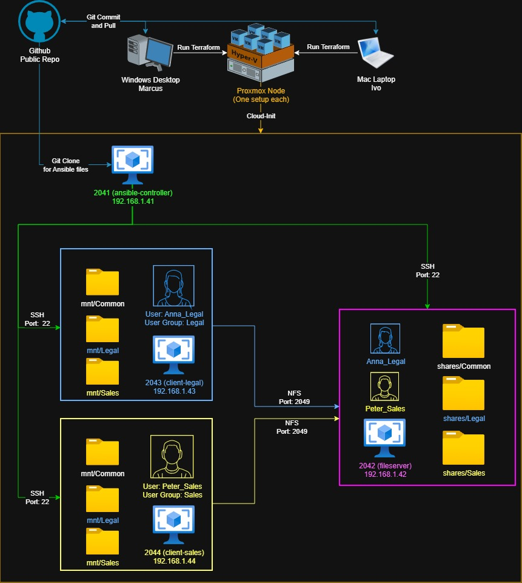

# Automated NFS-Fileserver Lab
    Project Name: Automated NFS-Fileserver Lab
    Authors: Marcus Kellner & Ivo Urbanovics
    Class: ITS25
    Course: Virtualization & Automation 
    Date: 2026-05-07 
    Branch: 09-polish3 
This is a lab built by Marcus and Ivo during the spring of 2026 as part of a vocational university course called Virtualization and Automation ("Virtualiseringsteknik och Automation" in Swedish). 

The project will instruct a Proxmox server to create several virtual machines using Terraform and configures the VMs with Ansible to install one NFS fileserver and two NFS client VMs. Two groups of users are created, shares are created on the fileserver and mounted automatically on the clients. Permissions and qoutas are assigned per group.

Our purpose was to learn how to create and document infrastructure as code while being able to manage it effectively by keeping idempotency preserved. The project also served as an introduction to working with GIT using the terminal and we have chosen to preserve our development branches to document our progress.

Total time spent is about four working weeks, including time spent learning Git-basics.

## Table of Contents
- [Project Architecture](#project-architecture)
- [Environment and IPs](#environment-and-ips)
- [Folder Structure](#folder-structure)
- [System Requirements](#system-requirements)
- [Getting Started](#getting-started)
- [Project Components](#project-components)
- [Verification](#verification)
- [Security](#security)
- [Design Choices](#design-choices)

## Project Architecture

## Environment and IPs
This is the default project environment:

| VM | Role | IP | Description |
|---|---|---|---|
|ansible-controller|Ansible control node|192.168.1.41|Lab orchestration through Ansible|
|fileserver|NFS Server|192.168.1.42|NFS Fileserver sets up shares|
|client-legal|Client|192.168.1.43|Client PC for Legal team, mounts NFS shares|
|client-sales|Client|192.168.1.44|Client PC for Sales team, mounts NFS shares|

Note: These IP addresses are the default in template.tfvars, when you set up your own secrets-file you can define your own IPs.

## Folder Structure

## System Requirements
### Proxmox VE hypervisor
    RAM:    11 GB
    Disk:   60 GB
    Proxmox version: 9.1.1
    Cloud-Init template: Ubuntu 22.04.5 LTS / "jammy" 

### Workstation Computer
    OS: Windows 10/11 or macOS Tahoe 26.4
    Software Installed:
        Terraform version: 1.14.8
        Git version: 2.53.0

## Getting Started 
### 1. Clone repository from Github
Download the repository to your workstation, see requirements above.

    git clone https://github.com/marcusjkellner/NFSserver.git
    cd NFSserver
### 2. Create a secrets-file from template.tfvars
Copy the template secrets-file and name it terraform.tfvars. 

Follow the instructions in the file to add an API-key, SSH-key and if needed you can also change the environment variables such as the IP-addresses.

    cp /terraform/template.tfvars /terraform/terraform.tfvars
    nano /terraform/terraform.tfvars
### 3. Start VM creation using Terraform
These instructions will initialize Terraform in the terraform-folder, check for syntax problems and the apply command will start the building process once you type "yes" to confirm. Note: The creation process takes about 6 minutes.

    cd terraform 
    terraform init 
    terraform validate
    terraform plan
    terraform apply  
### 4. SSH into VM: ansible-controller
Once complete, it's time to SSH into the ansible controller node.

    ssh controller@192.168.1.41

IMPORTANT NOTE: The IP 192.168.1.41 is the default-template for controller_ip and must match your environment variables in terraform.tfvars!
### 5. Git Pull and Run site.yml to start all playbooks
The Controller should already have the latest version of this repository downloaded. Move into /ansible and run site.yml. It contains all playbooks necessary for the remaining configuration.

    cd ~/NFSserver/ansible 
    ansible-playbook site.yml
### 6. Verify lab functionality
Once the playbook is finished you can run a separate playbook called verify.yml. It will run a few tests verifying the UFW-configuration, user permissions and disk qouta. For more details see "Verification" below.

    ansible-playbook verify.yml 
## Project Components
### Workstation: Windows or Mac
- Marcus is using a Windows Desktop.
- Ivo is using a Macbook Air.
- The project is designed to execute on either workstation without maintaining different versions of the code.

### Hypervisor: Proxmox node
- To create and host our infrastructure we use Proxmox in our repective homelab environments. This means that we need to assign IP-addresses to variables in order to adapt our code for both setups. 
- For our VMs we have created a template from cloud-init. It's a Ubuntu server 22.04.5 LTS / jammy.
- In order to use Terraform with Proxmox we both needed to create separate API-keys. These are never uploaded to github.
- In order to access our Proxmox host for the on-site presentation, we will connect to one of our homelabs using Tailscale.
### VM: Ansible Controller
- This is the first VM we create in Terraform. The other VM's are dependant on this VM in order to be created and later configured with Ansible.

        Name:   ansible-controller
        ID:     2041    
        RAM:    4096 MB 
        Cores:  2 
        Disk:   10 GB
### VM: NFS Fileserver
- This VM is set up as an NFS fileserver which the clients will connect to using NSF.

        Name:   fileserver
        ID:     2042
        RAM:    2560 MB 
        Cores:  2 
        Disk:   20 GB (10 GB OS + 10 GB Filestorage) 
Directories on fileserver:

    /shares
        /shares/Common - users-group can read and write 
        /shares/Legal - only Legal-group can read and write 
        /shares/Sales - only Sales-group can read and write
### VM: Legal Department Client PC
- This client is created for the Legal team to connect to the NFS fileserver.

        Name:   client-legal
        ID:     2043
        RAM:    2560 MB
        Cores:  2 
        Disk:   10 GB  
### VM: Sales Department Client PC
- This client is created for the Sales team to connect to the NFS fileserver.

        Name:   client-sales 
        ID:     2044
        RAM:    2560 MB
        Cores:  2 
        Disk:   10 GB
### Terraform files
**main.tf** 
- Defines two virtual machines: ansible_controller and fileserver 

ansible_controller is the only VM provisioned in Terraform since Ansible can be used to provision the remaining VMs after this step:
- APT cache is updated.
- Ansible is installed.
- Ansible Galaxy 2.5.9 is installed.
- Ansible Galaxy 1.3.6 is removed to make sure 2.5.9 is used.
- Controller generates own SSH key pair used to connect to other VMs
- Controller clones public Git repo

**clients.tf** 
- Defines two virtual machines: client-legal and client-sales. 

**template.tfvars** 
- A template used for creating your terraform.tfvars file.

**terraform.tfvars** 
The secrets-file, where you enter your:
- OS type
- Proxmox api token
- Desktopt's ssh public key
- Proxmox endpoint with the port
- Proxmoxx nodename
- VM template ID
- VM gateway IP
- IP addresses for the VMs

**variables.tf** 
- The variable file where we define all variables used by Terraform. 

**versions.tf** 
- In the version file there are declared all the dependecies that Proxmox is using.

**providers.tf** 
- Here we define the provider, that in our case is Proxmox.

### Ansible files
**ansible.cfg** 
- Configuration file for Ansible.

        [defaults]
        inventory = inventory.ini
        host_key_checking = False
        pipelining = true

- inventory.ini is set as the default inventory.
- Host key checking is disabled for ansible in order to let ansible to SSH without fingerprinting.
- pipelining is set to true in order for our verify-script to change users when performing the tests.

**inventory.ini** 
- Used to define roles with IPs, users and SSH key locations.
- This file is generated upon running main.tf in order to inject user defined IP-addresses from the environment variables set in terraform.tfvars.

### Ansible playbooks
**01_nfs_install.yml** 
- Updates the fileserver with apt update.
- Installs nfs on filserver.
- Installs quota tools on filserver.

**02_nfs_users.yml** 
- Creates two user groups: group-Legal and group-Sales.
- Creates two users: Anna_Legal Peter_Sales.
- Each group is assigned an explicit GID.
- Each user is assigned an explicit UID.
- Groups and users are created identically on the fileserver and both clients.

**03_nfs_setup_disk.yml** 
- Creates a new partition and formats it for use with the quote-system.
- Check if partition is allready formated.
- Only format partition if unformated. 
- Creates the /shares directory on the new partition.
- Mounts /shares with quota support.

**04_nfs_shares.yml** 
- Creates the directories on the fileserver that will be shared.

        /shares/Common  
            mode: 0775
                Root can read, write, enter
                Legal and Sales can read, write, enter
                Users can read, write, enter
        /shares/Legal
            mode: 2770
                Root can read, write, enter
                Legal can read, write, enter
                Others blocked
        /shares/Sales
            mode: 2770
                Root can read, write, enter
                Sales can read, write, enter
                Others blocked

**05_nfs_exports.yml** 
- Adds /Common /Legal and /Sales to /etc/exports on the fileserver.
- Applies NFS exports to be shared on the lab-network.
- Starts up the NFS service on the fileserver.

**06_nfs_ufw.yml** 
- Installs UFW on fileserver and both clients.
- Configures UFW rules on fileserver and clients separatly.
- Enables the UFW service once configuration is done.

**07_client_install.yml** 
- Installs the NFS-client package on both clients.

**08_client_mount.yml** 
- Creates mounting points on both clients:

        /mnt/Common
        /mnt/Legal
        /mnt/Sales

**09_client_shares.yml** 
- Mounts mnt/shares on both clients to sync with fileserver:

        /mnt/Common > fileserver /shares/Common
        /mnt/Legal  > fileserver /shares/Legal
        /mnt/Sales  > fileserver /shares/Sales

**10_nfs_quotas.yml** 
- Remounts /shares on the fileserver.
- Perform a quota check.
- Grant users persmission to view their own quota.
- Set quotas for groups and users.
- Perform another quotacheck to establish usage.
- Perform and print a quota report in the terminal.

**site.yml** 
- This file will run all configuration playbooks in order 1-10.
 
**verify.yml** 
- This playbook runs a test in 4 steps to verify project functionality.
- For details please reference the Verification section below.    

## Verification
The verification playbook contains 4 separate plays designed to act as users Anna_Legal and Peter_Sales to demonstrate our lab's functionality.
### Verification Steps
verify.yml contains 4 playbooks designed to perform different types of tests. All tests are performed in this order:

Step 1 - Test UFW firewall rules:
- Netcat is used to check ports on the VMs according to the UFW-rules.
- fileserver is allowing port 2049 for NSF traffic only from the client VMs.
- ansible-controller should be able to use port 22 to SSH the other VMs.
- clients are blocked from using port 22 to SSH into the fileserver.
- Print test Pass/Fail results to terminal.

Step 2 - Anna creates files:
- User Anna_Legal attempts to create a 1 MB testfile in /Common.
- User Anna_Legal attempts to create a 1 MB testfile in /Legal.
- User Anna_Legal attempt to enter /Sales, but should be denied.

Step 3 - Peter creates files:
- User Peter_Sales attempts to create a 2 MB testfile in /Common.
- User Peter_Sales attempts to create a 2 MB testfile in /Sales.
- User Peter_Sales attempt to enter /Legal, but should be denied.

Step 4 - Get quota report, print summary and cleanup files:
- Syncs quota usage and get the quota report.
- Print quota report to terminal.
- Print permission summary report from step 2-3.

### Expected Terminal output
Firewall Test Summary:

        "=======================================",
        "===    UFW FIREWALL TEST SUMMARY    ===",
        "=======================================",
        "FILESERVER:",
        "  NFS (2049) from controller  → BLOCKED : PASS ✅",
        "  NFS (2049) from clientLegal → ALLOWED : PASS ✅",
        "  NFS (2049) from clientSales → ALLOWED : PASS ✅",
        "  SSH (22)   from controller  → ALLOWED : PASS ✅",
        "  SSH (22)   from clientLegal → BLOCKED : PASS ✅",
        "  SSH (22)   from clientSales → BLOCKED : PASS ✅",
        "======================================="

Quota Report:

        "=======================================",
        "===    VERIFICATION SUMMARY         ===",
        "=======================================",
        "  /mnt/Common → CAN write    : PASS ✅",
        "  /mnt/Legal  → CAN write    : PASS ✅",
        "  /mnt/Sales  → ACCESS DENIED: PASS ✅",
        "---------------------------------------",
        "PETER_SALES (from clientSales):",
        "  /mnt/Common → CAN write    : PASS ✅",
        "  /mnt/Sales  → CAN write    : PASS ✅",
        "  /mnt/Legal  → ACCESS DENIED: PASS ✅",
        "=======================================",
        "======================================="

User Permissions Report:

        "=======================================",
        "===    VERIFICATION SUMMARY         ===",
        "=======================================",
        "  /mnt/Common → CAN write    : PASS ✅",
        "  /mnt/Legal  → CAN write    : PASS ✅",
        "  /mnt/Sales  → ACCESS DENIED: PASS ✅",
        "---------------------------------------",
        "PETER_SALES (from clientSales):",
        "  /mnt/Common → CAN write    : PASS ✅",
        "  /mnt/Sales  → CAN write    : PASS ✅",
        "  /mnt/Legal  → ACCESS DENIED: PASS ✅",
        "=======================================",
        "======================================="

## Security
## Security Measures Taken
In our lab there is a following security measures applied:

1. API token is created on the Proxmox and placed on the tfvars file that provides a secure connection from the Desktop to the Proxmox hypervisor without any root credentials. 

2. Root login is only allowed with SSH key and password login is disabled. Expected output: permitrootlogin without-password

        sudo sshd -T | grep permitrootlogin

3. Password login is not allowed, only with SSH-key. The SHH keys for all VMs are generated on the creation of Controller VM that secures the Controller's connection with Fileserer, Legal and Sales VMs without password. Expected output: passwordauthentication: no  

        sudo sshd -T | grep passwordauthentication

4. UFW firewall is active on Filesever VM. Expected output: Status: active. SSH (port 22) connection allowed-in from Controller VM only. NFS (port  2049) allowed-in connection from Clients' (Legal and Sales) VMs port. Default: deny (incomming). No outgoing traffic is blocked.  

        sudo ufw status verbose

5. Client firewall is active on both Clients' VMs. Expected output, example on Client_Legal. Satus: Active. SSH (port 22) connection allowed-in from Controller VM only. Default: deny (incomming). No outgoing traffic is blocked.  

        sudo ufw status verbose 

6. Role Based Access Control (RBAC) setup.  Legal and Sales groups have least priviledge permissions to the NFS shares folder based on their roles. Expected output. Users /shares/Common: drwxrwxr-x.  group_Legal /shares/Legal: drwxrws---  .  group_Sales /shares/Sales: drwxrws---  . For more description please view Verify file output. 

7. Disk quotas and partition on the Fileserver is set to the hard disk that prevents denial of service by disk exhaustion. Since NFS shares is stored on a separate partition any disc exhaustion attack is limited and the OS partition is unaffected.  

        lsblk | grep -E "sda|sdb"

8. Secrets management. All the secret-relevant information is placed under nfsserver/terraform.tfvars and nfsserver/terraform.tfstate and stored only locally. Additionally both files is added to .gitignore and never stored in the git repository. Must be deployed from Desktop or Controller VM  

        cd NFSserver 
        cat .gitignore 
        
### Security Vulnerbility Analysis
#### 1. No Certificates, only SSH-keys
It would be more ideal to use a certificate based approach rather than ssh-keys for creating trust between our vms. An internally signed TLS certificate is more secure since SSH keys can get stolen or leaked my mistake.

**Solution:**

We could set up a CA to issue our internal TLS certificate or use party service if it was a production environment.

**Why this is acceptible:**

The lab network is not directly exposed to the internet and no SSH keys are available online.

#### 2. No Network Segmentation
Currently we have no segmentation between our VMs. We could consider setting up VLANs and separate this project from the rest of our homelabs. 
Solution: In production the fileserver should be separated on an isolated network/vlan without internet access. The client-groups (Legal/Sales) could also be set to their own vlan to restrict lateral movement.  
Why this is acceptible: We prioritized functionality over hardening. Instead we used UFW to enforce default deny incoming traffic.  
#### 3. No Encryption in transit btween clients and fileserver
Since NFS is sent in plaintext it is possible to intercept, tamper with or clone the information in transit. 
Solution: In production the information could be encrypted before transmission, a VPN tunnel could be set up or we could switch to SAMBA  
Why this is acceptible: In this lab we have not prioritized encryption and the only files on the server are for testing purposes  
#### No Encryption at rest
At the moment we do not encrypt data on the fileserver at rest. This means that anyone with access to the disk can read the files on the server in plaintext.
Solution: We could use encryption like LUKS to encypt data at rest but would need a different solution for data in transit. 
Why this is acceptible: In this lab we have not prioritized encryption and the only files on the server are for testing purposes  
#### No outgoing UFW rules
In this lab we wanted to include UFW rules and opted to implement default deny incoming traffic on fileserver and clients. There are no rules enforcing outgoing traffic atm and this means its possible for an attacker or malware exfiltrate information from the fileserver.
Solution: Configure firewall rules that default deny incoming and outgoing traffic and only allow traffic that is needed.  
Why this is acceptible: We did not want prioritize configuring firewall rules for this lab and will revisit the firewall in the upcoming hardening course.  
#### No NFS user Authentication
There is no strong authentication for users Anna_Legal and Peter_Sales, this means they cannot log in to their computers. It also means that you could spoof user identity by copying their UID/GID and stealing their SSH key.
Solution: Generate default passwords for each user and require them to set strong passwords upon logging in for the first time. MFA and/or AD could also be used for stronger authentication. 
Why this is acceptible: We do not want to add default credentials to the lab and we can use ansible to simulate them creating files for verification.  
#### No backup of NFS fileserver contents
The contents of the fileserver is not backed up on a separate VM, a separate physical device or a separate physical site. This means that any data on the fileserver is lost upon VM destruction.
Solution: Create one backup that is read-only locally, one that is encrypted on a cloud server and one that is mirrored to an off-site location NAS.  
Why this is acceptible: The files on the fileserver are only used for testing in this lab andd we did not want to dedicate resources for hardening these files.  

Other misc vulnerbilities:
- Host key checking is disabled for ansible, this means fingerprinting is not required for SSH
    - This can be solved by pre-populating a known-hosts file during initial provisioning.
- No strong SSH-key password
- Root Access through SSH
- Root-privileges allow for total control of all files
- No audit logging or monitoring
- Missing fail2Ban to protect against password bruteforce
- All members in "users" group can write to /Common
- Missing Ansible Tower features

## Design Choices

### Design and topology
Focus on the basic concepts working, not volume or hardening. 
### Packages Used
Workstations:

    Git version: 2.53.0
    //To commit project code to public git-repo

    Terraform version: 1.14.8
    //To run Terraform files with Proxmox

ansible-controller:

    Git version: 2.53.0 
    //To clone public repo from Github

    Ansible version: 2.10.8
    //To run Ansible Playbooks in git-repo

    Ansible Galaxy version: 2.5.9
    //[Parted] module: partition management
    //[Filesystem] module: disk formatting
    //[UFW] module: UFW firewall rules.

fileserver:

    NFS-kernel-serve version: 1:2.6.1-1ubuntu1.2
    //To start the NFS-service 

    Quota Utilities version: 4.06
    //To create quotas on the filestorage-partition

client-legal & client-sales 

    NFS-common version: 1:2.6.1-1ubuntu1.2
    //To interface with the NFS service from clients

### Proxmox Terraform vs Virtualbox and Vagrant
We wanted to learn how to use Proxmox and use a type 1 hypervisor in order to get the most out of the spare computers we keep at home. Using Proxmox with Terraform also seemed closer to reality and working with a cloud production.

We got to learn about using Cloud-Init and setting up our own ubuntu template. We do not rely on pre-installed packages but wanted to get everything needed. 

### Multiplatform and customized network project 
We choosed to build the home-lab on our own hardware, using customized own networks and OS for Desktop access. Thats why there are used creation of the ansible inventory file locally.

### VPN / Tailscale
In order to work remotely we choosed a Tailscale VPN solution, for that we created a separate Tailscele VM.

### NFS vs Samba
NFS is Linux based only and was easyer to set up for this project. Samba would have been a better option for use with Active Directory and Windows clients.

#### NFS Protocol
In our lab we are using the NFS-protocol. It works well, when high performance is needed and the enviroment is Linux-exclusive. However, the protocol not very secure on its own:
- There is no encryption for data at rest or data in transit.
- It is possible for anyone with physical access to sniff the trafic in plaintext or even tamper with it.
- There is no strong authentication, NFS relies on GID and UID which can be spoofed
- If the system is exposed to the internet and/or untrusted users locally NFS needs to be combined with other means of encryption, segmentation and authentication to be considered secure. 

#### Samba Protocol
SMB/Samba is better if the environment is shared between Linux and Windows users. It comes with authentication through Active Directory, but that also means Active Directory needs to be configured and managed. It supports encryption through SMB3 and is better suited for connected office environments.

#### When to use NFS over Samba
If all devices run Linux and are isolated from other networks and the internet it provides fast file transefer and feels simillar to using your own local storage. 

#### How to improve NFS security
- Encrypt data in transit using a VPN or simillar service like Kerberos
- Segment the devices using NFS onto their own network
- Encrypt the data at rest with separate encryption method, like LUKS
Note: Every measure that fascilitates ecryption will come with a hit to perfromance and convenience, either through distribution of encryption keys or passwords.

### Playbook design
We choose to split our playbooks in to 10 separate steps. This fraqtionality allowed us to build the project in steps and keep things separate that allowed us to test the performance and error handling under the way.

### Groups and users
We choose to create two user groups and with one user to each group. This enables role-based permissions and keep our project simple. 

### Verification 
We choose to simulate users attemting to create files in their own and others' directories. Also we simulated their permission rights to their own and the other's direcotries  access directory. The verification is performed with ansible code to proove the indepontence. A quota report is printed a the end of the simulation to prove each user-group quota is working before deleting the simulation files. 

During the verification we also ensure to use netcat to check ports on the VMs from clients and controller in order to verify the different UFW rules we have set in place. The rules are currently pretty rudimentary and is focused on setting default deny on incoming traffic to the fileserver and clients while maintaining functionality over SSH and NFS ports.

